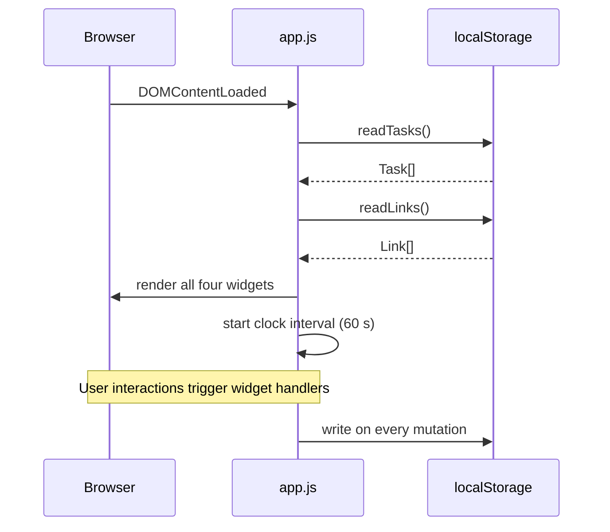
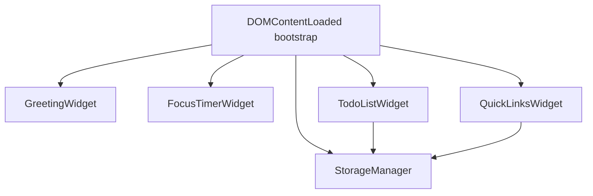
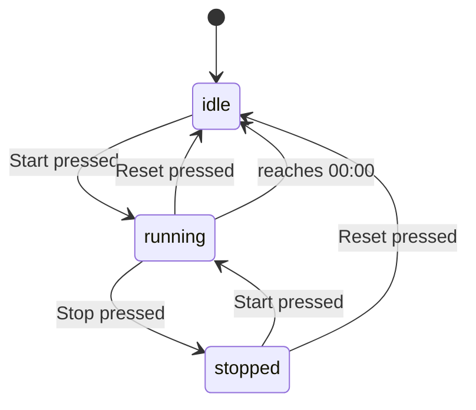

# Design Document: To-Do List Dashboard

## Overview

The To-Do List Dashboard is a fully client-side, single-page web application delivered as a set of static files. There is no build step, no bundler, and no server — the user opens `index.html` directly from the file system or any static host. All application logic lives in one JavaScript file (`js/app.js`) and all styling lives in one CSS file (`css/style.css`).

The application displays four independent but co-located widgets on a single page:

| Widget | Responsibility |
|---|---|
| Greeting Widget | Shows current time, date, and a time-of-day greeting |
| Focus Timer | 25-minute countdown with Start / Stop / Reset |
| To-Do List | Task CRUD with completion state |
| Quick Links | User-defined website shortcut buttons |

All user data (tasks and quick links) is persisted to `localStorage`. The app must work in Chrome, Firefox, Edge, and Safari (current stable releases) both when served over HTTP and when opened via a `file://` URL.

---

## Architecture

### High-Level Structure

The application follows a **module pattern** — every logical concern is an immediately-invoked or explicitly-called function scope within `app.js`. Because the constraint is a single JS file, there are no ES module imports; instead, each "module" is an object literal or an IIFE (Immediately Invoked Function Expression) assigned to a well-named constant. This keeps the code organised without requiring a bundler.

```
index.html
├── css/style.css          (all visual styling)
└── js/app.js              (all application logic)
    ├── StorageManager     — read/write Local Storage
    ├── GreetingWidget     — clock, date, greeting
    ├── FocusTimerWidget   — countdown timer state machine
    ├── TodoListWidget     — task CRUD + render
    └── QuickLinksWidget   — links CRUD + render
```

### Execution Flow



### Module Dependency Graph



`StorageManager` has no dependencies. The four widgets depend on `StorageManager` only for persistence. Widgets do not depend on each other.

### Design Decisions

**Single-file JS without a bundler** — The requirement of exactly one `js/app.js` rules out ES modules split across files. The chosen approach is a single file structured as a series of const-assigned object literals, each representing a module. This is readable, testable, and compatible with `file://` URLs (which can have CORS issues with `<script type="module">`).

**No reactive framework** — Vanilla DOM manipulation keeps the dependency surface at zero. Each widget owns a render function that rebuilds its inner HTML from current state. Re-rendering only the affected widget on every mutation keeps performance acceptable for the data volumes specified (≤1,000 tasks, ≤100 links).

**localStorage as the only persistence layer** — Synchronous `localStorage` calls are used because they are universally supported in the target browsers and work under `file://`. The 50ms main-thread constraint (Requirement 9.3) is met because serialising ≤1,000 small task objects to JSON takes well under 1ms on any modern device.

---

## Components and Interfaces

### StorageManager

Responsible for all `localStorage` reads and writes. Exposes a simple key/value-like API so that widget code never calls `localStorage` directly.

```javascript
const StorageManager = {
  KEYS: {
    TASKS: 'tld_tasks',
    LINKS: 'tld_links',
  },

  // Returns Task[] or [] on error; shows errorMessage on parse failure
  readTasks()  → Task[],

  // Returns Link[] or [] on error; shows errorMessage on parse failure
  readLinks()  → Link[],

  // Serialises tasks to JSON and calls localStorage.setItem
  // Returns true on success, false on failure (quota/access error)
  writeTasks(tasks: Task[])  → boolean,

  // Serialises links to JSON and calls localStorage.setItem
  // Returns true on success, false on failure
  writeLinks(links: Link[])  → boolean,

  // Internal: wraps JSON.parse in try/catch
  _parse(json: string, fallback: any)  → any,

  // Internal: displays a persistent banner error message in the DOM
  _showError(message: string)  → void,
}
```

**Error handling contract**: If `localStorage` is unavailable (e.g., thrown `SecurityError`) or a stored value fails JSON parsing, `StorageManager` returns the fallback value and calls `_showError` to insert a visible banner into the page (Requirement 6.6, 6.7, 8.4).

---

### GreetingWidget

Manages the greeting section DOM. Has no persistent state.

```javascript
const GreetingWidget = {
  // Called once at startup; starts the 60-second interval
  init(containerEl: HTMLElement)  → void,

  // Writes current time, date, and greeting to the DOM
  _render()  → void,

  // Returns HH:MM string for the given Date
  _formatTime(date: Date)  → string,

  // Returns "Weekday, Month Day" string (e.g. "Wednesday, October 8")
  _formatDate(date: Date)  → string,

  // Returns greeting string based on hour (0–23)
  _getGreeting(hour: number)  → string,
}
```

**Greeting boundary table** (implements Requirements 2.3–2.6):

| Hour range | Greeting |
|---|---|
| 05–11 | Good Morning |
| 12–17 | Good Afternoon |
| 18–21 | Good Evening |
| 22–23, 00–04 | Good Night |

The interval fires every 60 000 ms (±browser timer jitter, typically <1 s). On each tick, `_render()` reads `new Date()` and updates the DOM in-place.

---

### FocusTimerWidget

Implements a state machine with three states: **idle**, **running**, **stopped**.



```javascript
const FocusTimerWidget = {
  // Internal state
  _state: 'idle',          // 'idle' | 'running' | 'stopped'
  _remainingSeconds: 1500, // 25 * 60
  _intervalId: null,

  // Called once at startup; binds button click handlers
  init(containerEl: HTMLElement)  → void,

  // Transitions to 'running', starts setInterval(1000)
  _start()  → void,

  // Transitions to 'stopped', clears interval
  _stop()  → void,

  // Transitions to 'idle', resets remainingSeconds to 1500
  _reset()  → void,

  // Called every second while running; decrements, checks 00:00
  _tick()  → void,

  // Rebuilds button states and display from current _state
  _render()  → void,

  // Returns "MM:SS" string for a seconds count
  _formatTime(seconds: number)  → string,
}
```

**Button enable/disable logic** (Requirements 3.4–3.6):

| State | Start | Stop |
|---|---|---|
| idle | enabled | disabled |
| running | disabled | enabled |
| stopped | enabled | disabled |

The Reset button is always enabled. Disabled buttons receive a `disabled` HTML attribute and a CSS class for visual indication (reduced opacity).

---

### TodoListWidget

Manages task CRUD. Internal state is an in-memory array of `Task` objects. Every mutation immediately calls `StorageManager.writeTasks()`.

```javascript
const TodoListWidget = {
  _tasks: Task[],   // in-memory working copy

  // Loads tasks from StorageManager, renders list
  init(containerEl: HTMLElement)  → void,

  // Validates (non-empty/non-whitespace, ≤500 chars), adds Task, saves, re-renders
  _addTask(text: string)  → void,

  // Flips task.completed, saves, re-renders
  _toggleComplete(taskId: string)  → void,

  // Switches the task row to edit mode
  _beginEdit(taskId: string)  → void,

  // Validates new text, updates task, exits edit mode, saves, re-renders
  _saveEdit(taskId: string, newText: string)  → void,

  // Exits edit mode without saving
  _cancelEdit(taskId: string)  → void,

  // Removes task by id, saves, re-renders
  _deleteTask(taskId: string)  → void,

  // Builds the task list DOM from _tasks
  _render()  → void,

  // Generates a collision-resistant id (crypto.randomUUID or Date.now fallback)
  _generateId()  → string,
}
```

---

### QuickLinksWidget

Manages link CRUD. Mirrors the TodoListWidget pattern.

```javascript
const QuickLinksWidget = {
  _links: Link[],

  // Loads links from StorageManager, renders panel
  init(containerEl: HTMLElement)  → void,

  // Validates fields, prepends https:// if needed, adds Link, saves, re-renders
  _addLink(label: string, url: string)  → void,

  // Removes link by id, saves, re-renders
  _deleteLink(linkId: string)  → void,

  // Builds the links panel DOM from _links
  _render()  → void,

  // Ensures URL starts with http:// or https://
  _normaliseUrl(url: string)  → string,

  // Generates a collision-resistant id
  _generateId()  → string,
}
```

**Max-links guard** (Requirement 7.8): When `_links.length >= 20`, `_render()` disables the add form controls and shows a "maximum reached" message. `_addLink()` also performs an early return for safety.

---

## Data Models

### Task

```javascript
/**
 * @typedef {Object} Task
 * @property {string}  id        - Unique identifier (UUID or timestamp string)
 * @property {string}  text      - Task description (1–500 characters)
 * @property {boolean} completed - Whether the task is marked done
 * @property {number}  createdAt - Unix timestamp (ms) of creation
 */
```

**localStorage key**: `tld_tasks`
**localStorage format**: JSON array of Task objects, e.g.:
```json
[
  { "id": "abc123", "text": "Review PR", "completed": false, "createdAt": 1728378000000 }
]
```

### Link

```javascript
/**
 * @typedef {Object} Link
 * @property {string} id        - Unique identifier
 * @property {string} label     - Display text (1–50 characters)
 * @property {string} url       - Full URL (1–2048 characters, always starts with http/https)
 * @property {number} createdAt - Unix timestamp (ms) of creation
 */
```

**localStorage key**: `tld_links`
**localStorage format**: JSON array of Link objects.

### Storage Layout

```
localStorage
├── tld_tasks  →  JSON string of Task[]
└── tld_links  →  JSON string of Link[]
```

Using a `tld_` prefix namespaces the keys and avoids collisions with other applications sharing the same origin or `file://` namespace.

### HTML Structure Sketch

```html
<!DOCTYPE html>
<html lang="en">
<head>
  <meta charset="UTF-8">
  <meta name="viewport" content="width=device-width, initial-scale=1.0">
  <title>Dashboard</title>
  <link rel="stylesheet" href="css/style.css">
</head>
<body>
  <div id="error-banner" hidden></div>

  <main class="dashboard-grid">
    <section id="greeting-widget"   class="widget">...</section>
    <section id="focus-timer-widget" class="widget">...</section>
    <section id="todo-list-widget"  class="widget">...</section>
    <section id="quick-links-widget" class="widget">...</section>
  </main>

  <script src="js/app.js"></script>
</body>
</html>
```

### CSS Layout Strategy

A two-column CSS Grid layout handles the four widgets. On narrow viewports (< 640px) the grid collapses to a single column via a `@media` query, satisfying the 320px minimum width requirement (Requirement 1.4). Widget spacing is implemented with `gap: 16px` on the grid container (Requirement 1.5). Each `.widget` has a distinct border or background, and section `<h2>` headings use different `font-size` values to create an objectively verifiable visual hierarchy.

```css
.dashboard-grid {
  display: grid;
  grid-template-columns: 1fr 1fr;
  gap: 16px;
  padding: 16px;
}

@media (max-width: 639px) {
  .dashboard-grid {
    grid-template-columns: 1fr;
  }
}
```

---

## Correctness Properties

*A property is a characteristic or behavior that should hold true across all valid executions of a system — essentially, a formal statement about what the system should do. Properties serve as the bridge between human-readable specifications and machine-verifiable correctness guarantees.*

### Property 1: Greeting correctness for all hours

*For any* integer hour in the range 0–23, `GreetingWidget._getGreeting(hour)` SHALL return exactly one of `{"Good Morning", "Good Afternoon", "Good Evening", "Good Night"}`, with every hour mapping to a greeting and no hour producing an unexpected value or throwing an error.

**Validates: Requirements 2.3, 2.4, 2.5, 2.6**

---

### Property 2: Time formatting always produces valid HH:MM

*For any* `Date` object, `GreetingWidget._formatTime(date)` SHALL return a string that matches the regular expression `^\d{2}:\d{2}$` — two zero-padded digits, a colon, two zero-padded digits — with values in range (hours 00–23, minutes 00–59).

**Validates: Requirements 2.1**

---

### Property 3: Timer countdown format always produces valid MM:SS

*For any* integer number of seconds in the range 0–1500, `FocusTimerWidget._formatTime(seconds)` SHALL return a string matching `^\d{2}:\d{2}$` with the correct minutes and seconds values.

**Validates: Requirements 3.1**

---

### Property 4: Non-empty task addition grows the list by exactly one

*For any* task list state and any string of 1–500 non-whitespace-only characters, calling `TodoListWidget._addTask(text)` SHALL increase `_tasks.length` by exactly one, and the newly added task's `text` property SHALL equal the trimmed input.

**Validates: Requirements 5.2**

---

### Property 5: Whitespace-only or empty input is silently rejected

*For any* string composed entirely of whitespace characters (including the empty string), calling `TodoListWidget._addTask(text)` SHALL leave `_tasks` completely unchanged — same length and same contents.

**Validates: Requirements 5.3**

---

### Property 6: Whitespace-only save edit preserves original task text

*For any* Task with any non-empty `text` value, calling `TodoListWidget._saveEdit(id, whitespaceOnlyString)` SHALL leave that Task's `text` property identical to its value before the call.

**Validates: Requirements 5.10**

---

### Property 7: Task completion toggle is a boolean flip

*For any* Task in any completion state, calling `TodoListWidget._toggleComplete(id)` SHALL invert the Task's `completed` boolean. Calling it twice in succession SHALL restore the Task to its original `completed` value (round-trip).

**Validates: Requirements 5.5**

---

### Property 8: Delete removes exactly the targeted item; others are preserved

*For any* non-empty collection (tasks or links) and any valid item id in that collection, calling the corresponding delete function (`_deleteTask(id)` or `_deleteLink(id)`) SHALL reduce the collection length by exactly one, SHALL remove the item with that id, and SHALL leave all other items unmodified (same ids, texts, and states in the same order).

**Validates: Requirements 5.12, 5.13, 7.4, 7.5**

---

### Property 9: Task persistence round-trip

*For any* array of Task objects written via `StorageManager.writeTasks(tasks)`, a subsequent call to `StorageManager.readTasks()` SHALL return an array that is deeply equal to the original — same length, same ids, same text values, same completion states, same creation timestamps.

**Validates: Requirements 6.1, 6.2, 6.3, 6.4**

---

### Property 10: Link persistence round-trip

*For any* array of Link objects written via `StorageManager.writeLinks(links)`, a subsequent call to `StorageManager.readLinks()` SHALL return an array that is deeply equal to the original — same length, same ids, same labels, same URLs, same creation timestamps.

**Validates: Requirements 8.1, 8.2**

---

### Property 11: URL normalisation always produces an http(s) prefix

*For any* non-empty string passed to `QuickLinksWidget._normaliseUrl(url)`, the returned string SHALL start with either `"http://"` or `"https://"`. If the input already starts with one of those prefixes, it SHALL be returned unchanged; otherwise `"https://"` SHALL be prepended exactly once.

**Validates: Requirements 7.7**

---

### Property 12: Adding a link with blank label or blank URL is rejected

*For any* Quick Links state, calling `QuickLinksWidget._addLink(label, url)` where either `label` or `url` is the empty string or a whitespace-only string SHALL leave `_links` completely unchanged — same length and same contents.

**Validates: Requirements 7.6**

---

## Error Handling

### localStorage Unavailable

On `init`, `StorageManager` wraps the initial read in a `try/catch`. If `localStorage` access throws (e.g., `SecurityError` in a sandboxed `iframe`, or when cookies/site data are blocked), the widget renders empty and `_showError` inserts a dismissible red banner at the top of the page:

> "Persistence unavailable: your data will not be saved this session."

### localStorage Parse Error

If the stored value exists but is not valid JSON (corrupted data), `_parse()` catches the `SyntaxError` and returns the fallback (`[]`). A banner is shown. The app continues operating in-memory for the session.

### localStorage Write Failure (Quota Exceeded)

`writeTasks` and `writeLinks` wrap `setItem` in a `try/catch`. On failure (typically `QuotaExceededError`), they return `false` and call `_showError`:

> "Could not save your change: storage is full."

The in-memory state is **not** reverted — the user's current session state is preserved even if it cannot be written to disk.

### Timer Overrun Guard

`FocusTimerWidget._tick()` clamps `_remainingSeconds` to a minimum of 0 and clears the interval when it reaches 0. This prevents negative display values if a browser timer fires slightly late.

### Input Validation

All text inputs are validated before any state mutation:
- Trim whitespace before length checks.
- Reject empty/whitespace-only values (no state change, no error banner — the UI feedback is the field remaining empty after a failed attempt).
- Clamp accepted text to the maximum length at the data layer, not just the `maxlength` HTML attribute, to guard against programmatic calls.

---

## Testing Strategy

### Unit Tests

Unit tests use a test runner compatible with `file://` execution (no Node.js required) or a lightweight runner like [QUnit](https://qunitjs.com/) loaded from a CDN script tag in a separate `test.html`. Each module function is tested in isolation.

Key unit test areas:

- `GreetingWidget._getGreeting(hour)` — all 24 hours, boundary values
- `GreetingWidget._formatTime(date)` — midnight, noon, single-digit hours/minutes
- `GreetingWidget._formatDate(date)` — day/month names, no leading zero on day
- `FocusTimerWidget._formatTime(seconds)` — 0, 1, 59, 60, 1500, boundary values
- `FocusTimerWidget` state machine — valid and invalid transitions
- `TodoListWidget._addTask()` — valid text, empty, whitespace-only, 500-char limit
- `TodoListWidget._saveEdit()` — valid update, whitespace-only rejection
- `StorageManager._parse()` — valid JSON, invalid JSON, null
- `QuickLinksWidget._normaliseUrl()` — already-prefixed, plain domain, empty

### Property-Based Tests

A property-based testing library is used to verify universal properties across randomly generated inputs. The recommended library for browser-compatible vanilla JS is **[fast-check](https://fast-check.dev/)**, loaded via a CDN `<script>` tag in `test.html` (no Node.js or bundler required).

Each property test is tagged with its design document property for traceability.

**Minimum 100 iterations per property test.**

| Property | Test description | Generator |
|---|---|---|
| Property 1 | `_getGreeting` returns a valid greeting for all hours | `fc.integer({ min: 0, max: 23 })` |
| Property 2 | `_formatTime(date)` matches `^\d{2}:\d{2}$` | `fc.date()` |
| Property 3 | `_formatTime(seconds)` matches `^\d{2}:\d{2}$` | `fc.integer({ min: 0, max: 1500 })` |
| Property 4 | Non-empty add grows list by 1, new task has correct text | `fc.string({ minLength: 1, maxLength: 500 })` filtered to non-whitespace |
| Property 5 | Whitespace-only add leaves task list unchanged | `fc.stringOf(fc.constantFrom(' ', '\t', '\n'))` |
| Property 6 | Whitespace-only save edit preserves original task text | Task arbitrary + whitespace string |
| Property 7 | Toggle completion is a boolean flip (round-trip) | Task arbitrary with random completed state |
| Property 8 | Delete removes exactly the targeted item, preserves others | `fc.array(ItemArbitrary, { minLength: 1 })` + random index |
| Property 9 | Task round-trip persistence | `fc.array(TaskArbitrary)` |
| Property 10 | Link round-trip persistence | `fc.array(LinkArbitrary)` |
| Property 11 | `_normaliseUrl` always returns http(s):// prefix | `fc.string()` |
| Property 12 | Empty/whitespace label or url rejects link add | empty and whitespace generators for label and url |

Tag format per test: `// Feature: todo-list-dashboard, Property N: <property text>`

### Integration / Manual Tests

Because this is a purely client-side UI application, end-to-end behaviour is verified manually against each browser target (Chrome, Firefox, Edge, Safari):

1. Open `index.html` via `file://` — all four widgets render within 2 seconds.
2. Add, complete, edit, and delete tasks; refresh — tasks persist.
3. Add and delete quick links; refresh — links persist.
4. Run timer to 00:00 — end-of-session indicator appears.
5. Fill localStorage to capacity (simulate via DevTools override) — error banner appears.
6. Open at 320px viewport width — no horizontal scroll.
